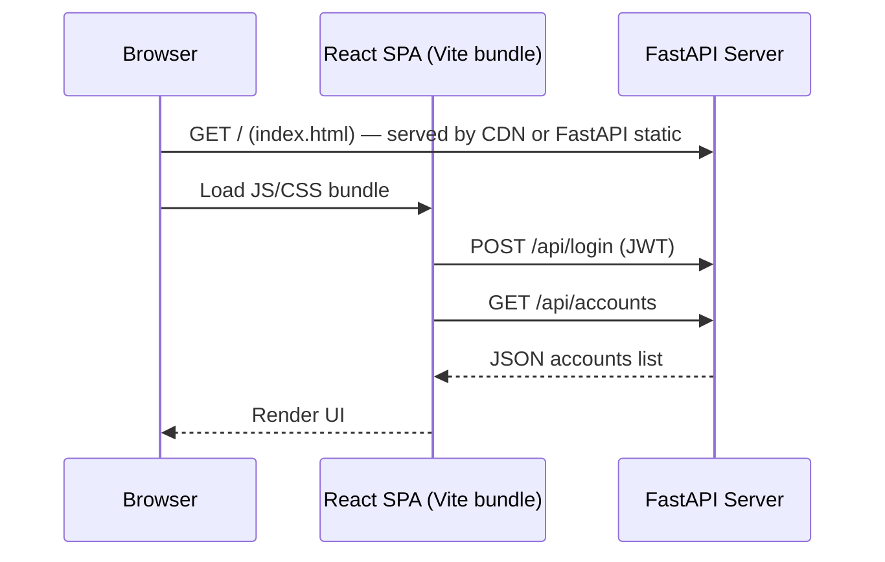

# Personal Finance App — Architecture & Conversation Summary *(Python + FastAPI + React)*

> **Goal:** Distill the lessons from the open‑source Ruby on Rails finance tracker into a **simpler, split‑frontend / backend personal finance app** you will build with **FastAPI (Python)** and a **React + Tailwind SPA**.

---

\## 1. Conversation Overview

Over multiple discussions we dissected the reference Rails project and mapped each idea to a Python ecosystem equivalent. Key topics we covered:

- Domain‑Driven entities (Accounts, Entries, Balances, Budgets …)
- Where business logic should live in Python (SQLAlchemy models, Pydantic schemas, service classes)
- Provider abstraction for external data (Plaid, exchange rates, brokerage APIs)
- Background jobs with Celery & Redis instead of Sidekiq
- **Split deployment**: React SPA (Vite) ↔ FastAPI JSON API (same or different origin)
- Authentication patterns (cookie vs. JWT) and CORS
- Translating Rails patterns (Models, Concerns, Service Objects) into Python idioms

---

\## 2. Core Architectural Concepts *(Python version)*

| Concept *(Rails)*          | Python / FastAPI Equivalent                              | Notes                                                     |
| -------------------------- | -------------------------------------------------------- | --------------------------------------------------------- |
| **Model** (`ActiveRecord`) | **SQLAlchemy model** (+ business logic)                  | ORM ↔ table mapping, associations, validators             |
| **Pydantic schema**        | Shapes request/response payloads, decouples DB from API  |                                                           |
| **Concern / Mixin**        | Plain Python mixin / utility module                      | Re‑usable behaviours (e.g. `Syncable`, `TimestampMixin`)  |
| **Controller**             | FastAPI **route function** or **APIRouter class**        | Handles HTTP params, auth, delegates to domain logic      |
| **Service Object**         | Plain Old Python Object (POPO) with `__call__` / `run()` | Encapsulates a business operation (e.g. `MatchTransfers`) |

> **Guideline:** Keep route handlers thin; push calculations into models, service classes, or dedicated calculator modules.

---

\## 3. Core Entities & Relationships (single‑tenant)

| Entity       | Purpose                              | Key Relationships                                       |
| ------------ | ------------------------------------ | ------------------------------------------------------- |
| **User**     | Single owner of all data             | has\_many → `accounts`, `budgets`                       |
| **Account**  | Bank, brokerage, property, wallet …  | belongs\_to → `user`; has\_many → `entries`, `balances` |
| **Entry**    | Transaction / valuation / trade      | belongs\_to → `account`; polymorphic via `entry_type`   |
| **Balance**  | Daily end‑of‑day value               | belongs\_to → `account`                                 |
| **Holding**  | Position in a security (investments) | belongs\_to → `account`, `security`                     |
| **Budget**   | Planned spending for a period        | belongs\_to → `user`; has\_many → `budget_categories`   |
| **Transfer** | Links two opposite `entry` rows      | references two `Entry` IDs                              |
| **Security** | Stock, ETF, crypto asset             | has\_many → `holdings`, `price_history`                 |

*Start small*: You can initially omit `Holding`, `Security`, and `Budget` if the MVP is just accounts + transactions.

---

\## 4. SPA ↔ API Flow (Split Frontend/Backend)



**Key Points**

1. The React bundle can be hosted **by FastAPI (**``**)** *or* via a separate static host (e.g. Netlify). 
2. All data flows through JSON endpoints under `/api/*`.
3. **CORS** must be enabled if the SPA is on a different origin.
4. Auth: choose **HTTP‑only JWT cookie** or classic session cookies (same‑site) to minimise JS token juggling.

---

\## 5. Syncing & Background Jobs (Celery)

| Job / Task                            | Trigger                           | What it does                                 |
| ------------------------------------- | --------------------------------- | -------------------------------------------- |
| **account.calculate\_daily\_balance** | Nightly cron or after new `Entry` | Aggregates entries into daily `Balance` rows |
| **account.update\_holdings**          | After trade import                | Re‑computes security positions               |
| **transfer.match\_pairs**             | After bulk import / Plaid sync    | Finds opposite inflow/outflow entries        |
| **provider.sync\_accounts**           | Manual or hourly schedule         | Calls Plaid / brokerage API, stores raw data |

Celery workers use the **same service classes** as the API to avoid duplication.

---

\## 6. Provider Abstraction Pattern (Python)

```text
providers/__init__.py     # Registry & base interface
providers/plaid.py        # Concrete provider
providers/mock.py         # Test stub
models/mixins/syncable.py # Mixin: adds .sync() that delegates to provider
```

- `Provider` base class defines standard methods (`fetch_accounts`, `fetch_transactions`).
- Registry returns the provider instance by name/id.
- Models call `provider.fetch_transactions(account_id)` via the mixin — never reference Plaid directly.

---

\## 7. Database Schema (initial)

```sql
users      (id UUID PK, email, password_hash, created_at…)
accounts   (id UUID PK, user_id FK, name, type, currency, current_balance)
entries    (id UUID PK, account_id FK, amount, currency, entry_type, date, description)
balances   (id UUID PK, account_id FK, date, balance, currency)
```

*Add tables progressively as features grow (budgets, holdings, sync\_logs…).*

---

\## 8. UI Stack (React + Tailwind)

| Concern              | Choice                                                                  |
| -------------------- | ----------------------------------------------------------------------- |
| **Build tool**       | **Vite** (fast HMR, easy FastAPI proxy during dev)                      |
| **Component lib**    | Headless UI + Tailwind UI kit or Radix UI                               |
| **State management** | React Query / TanStack Query for API caching                            |
| **Routing**          | React Router v6 ↔ maps to API resources                                 |
| **Design tokens**    | Tailwind config (`theme.extend.colors`) matches reference design system |
| **Auth hooks**       | `useAuth()` talks to `/api/login`, manages JWT cookie                   |

> **Progressive Enhancement:** Even though this is a full SPA, keep screens functional with minimal JS by server‑side rendering skeleton HTML when feasible (e.g. for landing pages).

---

\## 9. Recommended Next Steps (Python + SPA)

1. **Set up the repo**
   - `/backend` → FastAPI + SQLAlchemy + Alembic
   - `/frontend` → React + Vite + Tailwind
2. **Define MVP entities** (`User`, `Account`, `Entry`, `Balance`) & auto‑generate Alembic migrations.
3. **Build auth flow** (JWT cookie) and a React `<AuthProvider>`.
4. **Create CRUD APIs** for Accounts & Entries; document via FastAPI OpenAPI.
5. **Implement Celery worker** w/ Redis broker; add `calculate_daily_balance` task.
6. **Provider abstraction**: start with a mock CSV import provider → later swap in Plaid.
7. **CI/CD pipeline**: unit tests (pytest), formatting (black, ruff), build frontend bundle, docker‑compose deploy.
8. **Stretch**: Net‑worth chart, category budgets, AI transaction descriptions (OpenAI), mobile PWA build.

---

\## 10. Appendix — Glossary

| Term          | Definition                                                                  |
| ------------- | --------------------------------------------------------------------------- |
| **POPO**      | *Plain Old Python Object* — regular class not tied to FastAPI or SQLAlchemy |
| **SPA**       | *Single‑Page Application* — React app renders UI entirely client‑side       |
| **CSR / SSR** | Client‑Side / Server‑Side Rendering                                         |
| **CORS**      | Cross‑Origin Resource Sharing; allow SPA to call API from different origin  |
| **JWT**       | JSON Web Token used for stateless auth                                      |
| **Celery**    | Python task queue for background jobs                                       |

---

**Keep this markdown in **`` and update it as the project evolves.

